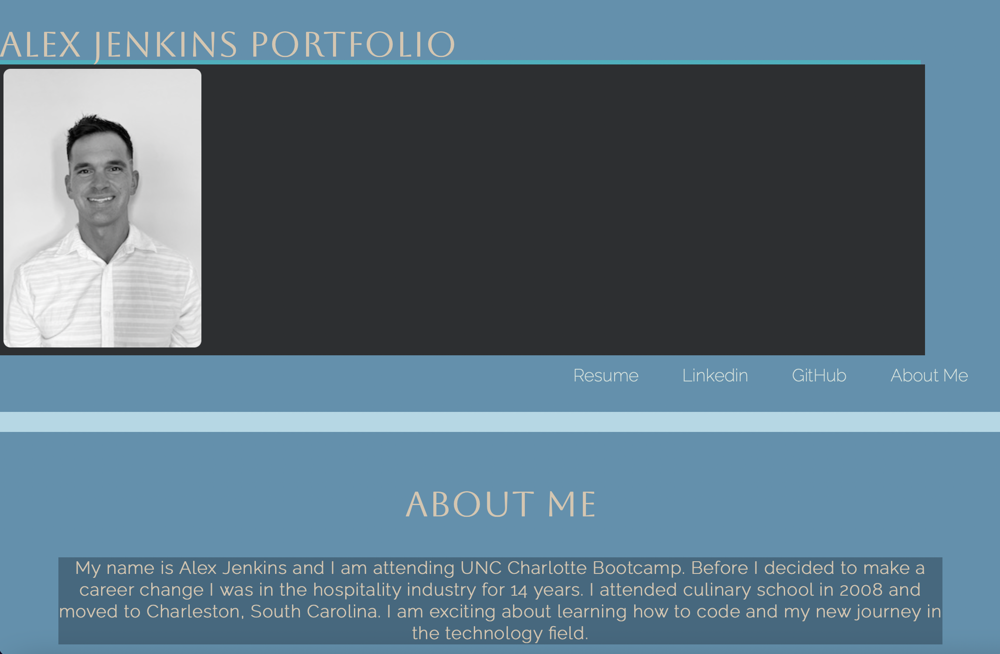

# Portfolio 
Second Challenge For UNC Charlotte Coding Bootcamp

# Description 
It is important as a web developer to have a professional portfolio when seeking future employment. 
This is basically your resume on a web-page that you personally created, coded, and designed to show your potential future employer. This can showcase your 
strengths that way your future employer can get a 
better understanding of your skill set. It is also important to make sure that your portfolio works and flows on all media devices. Take your time and have fun making your portfolio.

## Porfolio Screen Shot Example 

## Link to GitHub Repository & Portfolio Webpage 
[GitHub](https://choosealicense.com/licenses/mit/)

